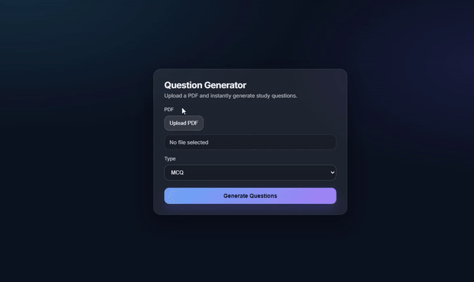

# 📘 AI PDF Question Generator & Study App

A full-stack web application that allows users to upload PDF lecture notes and automatically generate **AI-powered study questions** (MCQs or SAQs), then review them using an interactive **flashcard-based study interface**.

This project demonstrates clean UI design, robust AI integration, and real-world handling of inconsistent LLM outputs.

---

## 🧠 How It Works

1. The user uploads a PDF document.
2. The backend extracts text from the PDF.
3. OpenAI generates study questions based on the extracted content.
4. The backend normalizes the AI output into a stable, predictable schema.
5. The frontend renders the questions as interactive flashcards.
6. Users flip flashcards to reveal answers and explanations.

---

## ✨ Features

- 📄 Upload PDF lecture notes  
- 🧠 Generate AI-based questions from content  
- 📝 Supports **MCQ** and **SAQ** formats  
- 🔀 Randomized MCQ options (no “always A” bias)  
- 🃏 Flashcard-style study mode  
- 🔁 Flip cards to reveal answers and explanations  
- ⏮️ Navigate between questions  
- 🎨 Minimal SaaS-style UI  
- 🛡️ Defensive backend handling for unpredictable AI output  


---


## 🎬 Demo

Below is a short demo showing the full flow of the application — uploading a PDF, generating AI-powered questions, and studying them using interactive flashcards.



---

## 🚀 Run Locally (Full Setup)

Follow the steps below to run the project locally.

```bash
# 1. Clone the repository
git clone https://github.com/blazej-wiz/AI-PDF-Question-Generator.git
cd AI-PDF-Question-Generator

# 2. Create and activate a virtual environment (backend)
python -m venv .venv

# macOS / Linux
source .venv/bin/activate

# Windows (PowerShell)
.venv\Scripts\Activate

# 3. Install backend dependencies
pip install -r requirements.txt

# 4. Set your OpenAI API key
# macOS / Linux
export OPENAI_API_KEY=your_api_key_here

# Windows (PowerShell)
setx OPENAI_API_KEY "your_api_key_here"

# (Restart terminal after setting the key on Windows)

# 5. Start the backend
uvicorn main:app --reload

#Open new terminal for frontend

# 6. Install frontend dependencies
cd frontend
npm install


# 7. Start the frontend
npm run dev
```

## 🔮 Future Improvements

- Answer selection and scoring
- Configurable number of generated questions
- “Explain further” tutor-style AI follow-ups
- Difficulty levels (easy / medium / hard)
- Progress tracking per PDF or study session
- User accounts and saved study history
