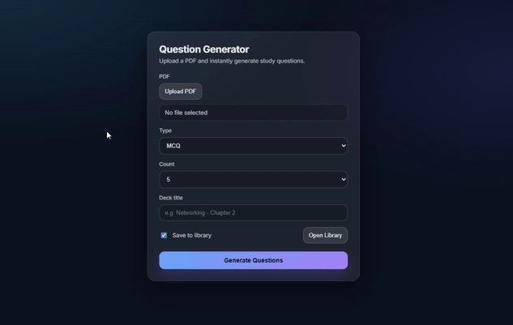

# 📘 AI PDF Question Generator & Study App

A full-stack web application that lets users upload PDF lecture notes and automatically generate **AI-powered study questions**, then review them using a polished **flashcard-based study interface** with progress tracking and a saved library.

This project focuses on **real-world AI reliability**, clean UI/UX, and production-style backend architecture.

---

## 🧠 How It Works

1. The user uploads a PDF document.
2. The backend extracts and chunks the text.
3. AI generates study questions based on the content.
4. The backend normalizes inconsistent AI output into a stable schema.
5. Questions are optionally saved to a **library** as a study deck.
6. Users study using interactive flashcards with answer grading.

---

## ✨ Features

### 📄 PDF → Questions
- Upload PDF lecture notes
- AI-generated questions from real document content
- Supports **MCQ** and **SAQ** formats
- Defensive normalization against unpredictable AI output

### 🃏 Study Experience
- Flashcard-style study mode
- Smooth flip animation (question ↔ answer)
- Explanations for MCQs
- Keyboard & mouse friendly interactions
- Scroll-safe layout for long questions

### ✅ Progress & Grading
- Mark answers as **Correct** or **Incorrect**
- Progress recorded per card
- Automatic advance through decks
- Completion state when a deck is finished

### 📚 Library
- Save generated decks to a library
- Revisit decks anytime
- Study directly from saved decks
- Delete decks when no longer needed

### 🎨 UI / UX
- Minimal, modern SaaS-style design
- Subtle animations and transitions
- Consistent typography and spacing
- Designed for long study sessions

---

## 🎬 Demo

Below is a short demo of the current version showing the full flow of the application 



---

## 🚀 Run Locally

```bash
# 1. Clone the repository
git clone https://github.com/blazej-wiz/AI-PDF-Question-Generator.git
cd AI-PDF-Question-Generator

# 2. Create and activate virtual environment (backend)
python -m venv .venv

# macOS / Linux
source .venv/bin/activate

# Windows (PowerShell)
.venv\Scripts\Activate

# 3. Install backend dependencies
pip install -r requirements.txt

# 4. Set your OpenAI API key
# macOS / Linux
export OPENAI_API_KEY=your_api_key_here

# Windows (PowerShell)
setx OPENAI_API_KEY "your_api_key_here"

# Restart terminal after setting the key on Windows

# 5. Start the backend
uvicorn main:app --reload

# 6. Start the frontend (new terminal)
cd frontend
npm install
npm run dev
```

## 🔮 Future Improvements

- PDF-level progress tracking
- Non-overlapping decks per document
- Study only incorrect answers
- Users accounts
